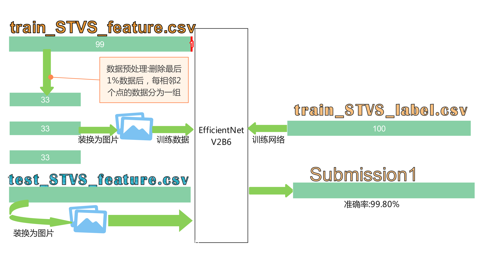
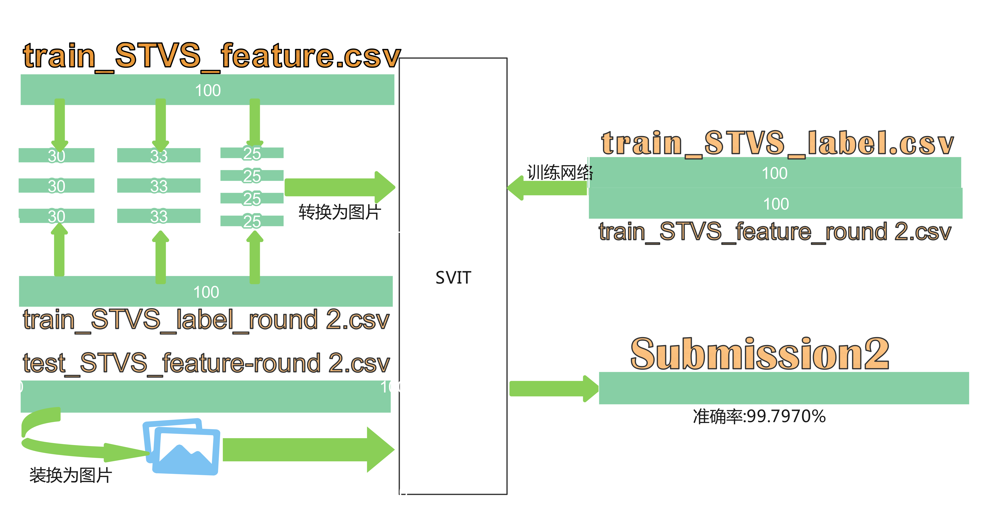

# 基于EfficientB6的初赛模型和基于SVIT的复赛模型

## 基本信息
- 赛道：赛道二
- 团队：苟进初赛
- 初赛得分:99.80%
- 复赛得分:99.7970%
- 复赛排名：12

## 解题思路
 - **特征工程**：以人的角度来看，判断电压是否失衡主要从图像来判断，因此将数据装换成了图片的形式，后续使用深度学习模型对图像进行分类。
 - **数据增强**：将原来的一行数据按一定比例分割，可以形成新的数据，从而形成多张照片。
 - 初赛和复赛解题思路图如下：
  
  
  

## 运行环境说明
由于笔者所有模型的训练均在kaggle上运行，包括了所有的训练过程，如果审核老师能够使用kaggle直接Fork的话能将会更好，或者直接查看我在kaggle上的训练过程，以便更好复现。下面两个链接是初赛复赛跑出最好得分时的训练过程和结果：
- [初赛：https://www.kaggle.com/code/zhouhua2022/unilab-submission?scriptVersionId=108502530](https://www.kaggle.com/code/zhouhua2022/unilab-submission?scriptVersionId=108502530)
  
- [复赛：https://www.kaggle.com/code/zhouhua2022/unilab-submission](https://www.kaggle.com/code/zhouhua2022/unilab-submission)

同时注意到，由于深度学习模型的准确率与初始化的权重有关，因此笔者也保存了模型得分最高时的模型数据，审核老师手中有真实的标签，因此审核的老师如果能够在训练过程中在每一个epoch后加上对测试集准确率的评分，那么就能更快的复现出最高分，甚至很大概率超过笔者的跑分。

下面是运行时使用的环境
GPU：Tesla P100
cuda版本：CUDA11.0
Python版本：3.7.12
torch版本：1.11.0

初赛运行时长（不包括数据处理）：
复赛运行时长（不包括数据处理）：

requirement.txt:
pandas
numpy
matplotlib 
tqdm
torch
gc
einops
timm
copyfile
torchvision
json
os
time